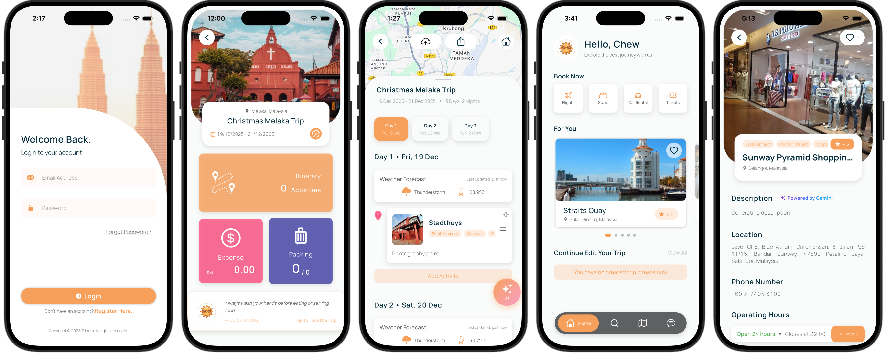

# Tripora - AI-Powered Travel Planning App


**Tripora** is a comprehensive Flutter-based mobile application designed to revolutionize travel planning with intelligent AI assistance, collaborative features, and seamless integration with travel booking services.

## 📱 Overview



Tripora is your all-in-one travel companion that helps you plan, organize, and execute perfect trips. From flight booking to itinerary creation, expense tracking to cultural preparation, Tripora leverages AI agents and cloud services to make travel planning effortless.

### Key Features

- **🤖 AI-Powered Planning** - Smart recommendations powered by AI agents
- **✈️ Flight Booking** - Integrated flight search and booking with autocomplete
- **📅 Itinerary Management** - Create and organize detailed day-by-day itineraries
- **💰 Expense Tracking** - Track and manage trip expenses in real-time
- **🎒 Smart Packing** - AI-generated packing lists customized to your destination and trip type
- **📍 Point of Interest Discovery** - Explore and save POIs with AI recommendations
- **💬 Travel Chat** - AI chatbot for travel advice and questions
- **🏨 Lodging Management** - Book and track accommodations
- **📝 Trip Notes** - Keep detailed notes and observations
- **🌍 Cultural Preparation** - Learn etiquette and cultural tips for your destination
- **📸 Social Sharing** - Share travel experiences through posts
- **💾 Cloud Sync** - All data synced across devices via Firebase

## 🏗️ Architecture

Tripora follows a layered MVVM architecture pattern:

```
lib/
├── core/                    # Core business logic
│   ├── models/             # Data models
│   ├── repositories/       # Data access layer
│   ├── services/           # External API integration
│   ├── theme/              # App styling & colors
│   ├── reusable_widgets/   # Reusable UI components
│   ├── utils/              # Utility functions
│   └── viewmodels/         # State management
├── features/               # Feature-specific implementations (with each folder includers model, view, viewmodel)
│   ├── auth/               # Authentication
│   ├── chat/               # Chat functionality
│   ├── expense/            # Expense tracking
│   ├── exploration/        # POI discovery
│   ├── feedback/           # User feedback
│   ├── home/               # Home screen
│   ├── itinerary/          # Itinerary management
│   ├── navigation/         # Navigation setup
│   ├── packing/            # Packing management
│   ├── poi/                # Point of Interest
│   ├── profile/            # User profile
│   ├── settings/           # App settings
│   ├── trip/               # Trip management
│   └── user/               # User management
└── main.dart               # App entry point
```

### Technology Stack

- **Framework**: Flutter 3.8.1+
- **Language**: Dart
- **State Management**: Provider 6.0.5
- **Backend**: Firebase (Auth, Firestore, Storage)
- **APIs**: Google Places, Google Maps
- **Local Storage**: JSON files via path_provider
- **UI Libraries**: 
  - Cupertino Icons
  - Lucide Icons
  - Flutter Staggered Grid View
  - Table Calendar
  - Marquee
  - Image Picker

## 🚀 Getting Started

### Prerequisites

- Flutter SDK 3.8.1 or higher
- Dart SDK
- Xcode (for iOS development)
- Android Studio (for Android development)
- Firebase account
- Google Places API key
- Google Maps API key

### Installation

1. **Clone the repository**
   ```bash
   git clone <repository-url>
   cd Tripora
   ```

2. **Install dependencies**
   ```bash
   flutter pub get
   ```

3. **Set up environment variables**
   - Copy the template file:
     ```bash
     cp .env.example .env
     ```
   - Edit `.env` and add your API keys:
     ```
     # Google APIs
     GOOGLE_MAPS_API_KEY=your_google_maps_api_key
     GEMINI_API_KEY=your_gemini_api_key

     # Firebase (Android)
     FIREBASE_API_KEY_ANDROID=your_firebase_android_api_key
     FIREBASE_APP_ID_ANDROID=your_firebase_android_app_id
     FIREBASE_MESSAGING_SENDER_ID=your_firebase_messaging_sender_id
     FIREBASE_PROJECT_ID=your_firebase_project_id
     FIREBASE_STORAGE_BUCKET=your_firebase_storage_bucket

     # Firebase (iOS)
     FIREBASE_API_KEY_IOS=your_firebase_ios_api_key
     FIREBASE_APP_ID_IOS=your_firebase_ios_app_id
     FIREBASE_IOS_BUNDLE_ID=your_firebase_ios_bundle_id

     # Flight Autocomplete (AviationStack)
     AVIATION_STACK_API_KEY=your_aviationstack_api_key
     ```
   - **Important**: Never commit `.env` to version control (already in `.gitignore`)

4. **Obtain API Keys**
   
   **Google APIs** (Google Maps & Gemini):
   - Visit [Google Cloud Console](https://console.cloud.google.com)
   - Create a new project or select existing one
   - Enable "Maps SDK for Android" and "Google Maps Platform"
   - Enable "Generative Language API" (for Gemini)
   - Create API Key credentials
   - Copy keys to `.env` file
   
   **Firebase**:
   - Go to [Firebase Console](https://console.firebase.google.com/)
   - Create a new Firebase project or select existing one
   - Run `flutterfire configure` to set up platform-specific configs
   - The required keys will be auto-populated or available in Firebase Console
   
   **AviationStack** (Flight Autocomplete):
   - Sign up at [AviationStack](https://aviationstack.com/)
   - Verify your email
   - Copy your API key from dashboard
   - Add to `.env` as `AVIATION_STACK_API_KEY`

5. **Configure Firebase**
   - For Android: Ensure `android/app/google-services.json` is present
   - For iOS: Ensure `ios/Runner/GoogleService-Info.plist` is present
   - Run: `flutterfire configure`

6. **Run the app**
   ```bash
   flutter run
   ```

## 📁 Project Structure

### Core Module

- **models/**: Data classes (User, Trip, Expense, Flight, etc.)
- **repositories/**: Abstract data access layer for all entities
- **services/**: Integration with Firebase, Google APIs, and AI services
  - `firebase_auth_service.dart` - Authentication
  - `firebase_firestore_service.dart` - Database operations
  - `place_auto_complete_service.dart` - Google Places autocomplete
  - `ai_agents_service.dart` - AI agent interactions
  - `map_service.dart` - Google Maps integration
- **theme/**: App-wide styling and color schemes
- **reusable_widgets/**: Shared UI components

### Features Module

Each feature follows a modular structure:
- **views/**: UI screens and page layouts
- **widgets/**: Feature-specific widgets
- **viewmodels/**: Business logic and state management

## 🔑 Key Services

### AI Services
- **AI Agents** - Intelligent travel recommendations
- **AI Chatbot** - Travel advice and Q&A
- **AI Description Generator** - Smart location/activity descriptions
- **Smart Packing** - AI-generated customized packing lists
- **For You Recommender** - Personalized activity recommendations

### External Integrations
- **Firebase Authentication** - User login & registration
- **Cloud Firestore** - Real-time database
- **Firebase Storage** - Image and file storage
- **Google Places API** - Location search and details
- **Google Maps** - Map visualization and routing
- **Flight Autocomplete** - Flight booking integration

## 🛠️ Development

### Building

```bash
# Debug build
flutter build apk --debug          # Android
flutter build ios --debug          # iOS

# Release build
flutter build apk --release        # Android
flutter build ios --release        # iOS
```

### Testing

```bash
flutter test
```

### Code Analysis

```bash
flutter analyze
```

### Formatting

```bash
dart format lib/
```

## 📚 Documentation

- [System Architecture](docs/architecture.md) - High-level system design
- [Flight Autocomplete Setup](docs/flight_autocomplete_setup.md) - Flight API configuration

## 🔐 Firebase Setup

1. Create a Firebase project at [Firebase Console](https://console.firebase.google.com/)
2. Enable authentication methods (Email/Password, Google Sign-In)
3. Create Firestore database
4. Set up Firebase Storage
5. Download and configure service files:
   - `google-services.json` (Android)
   - `GoogleService-Info.plist` (iOS)

## 🌍 API Configuration

All API keys are stored securely in the `.env` file and are **not** committed to version control.

### Environment Variables (.env)

Create a `.env` file in the project root (copy from `.env.example`) with the following variables:

| Variable | Source | Purpose |
|----------|--------|---------|
| `GOOGLE_MAPS_API_KEY` | Google Cloud Console | Maps and Places API |
| `GEMINI_API_KEY` | Google Cloud Console | AI description generation |
| `FIREBASE_API_KEY_ANDROID` | Firebase Console | Android Firebase auth |
| `FIREBASE_API_KEY_IOS` | Firebase Console | iOS Firebase auth |
| `FIREBASE_APP_ID_ANDROID` | Firebase Console | Android app identification |
| `FIREBASE_APP_ID_IOS` | Firebase Console | iOS app identification |
| `FIREBASE_MESSAGING_SENDER_ID` | Firebase Console | Push notifications |
| `FIREBASE_PROJECT_ID` | Firebase Console | Firestore database |
| `FIREBASE_STORAGE_BUCKET` | Firebase Console | File storage |
| `FIREBASE_IOS_BUNDLE_ID` | Firebase Console | iOS bundle identifier |
| `AVIATION_STACK_API_KEY` | AviationStack Dashboard | Flight data & autocomplete |

### Loading Environment Variables

The app automatically loads the `.env` file on startup in `main.dart`:
```dart
void main() async {
  WidgetsFlutterBinding.ensureInitialized();
  
  // Load environment variables
  await dotenv.load(fileName: ".env");
  
  // Initialize Firebase and other services...
}
```

### Security Best Practices

- ✅ Store `.env` in `.gitignore` - Never commit API keys
- ✅ Use `.env.example` as a template for team members
- ✅ Regenerate compromised keys immediately
- ✅ Use environment-specific `.env` files (.env.local, .env.dev, etc.)
- ✅ Restrict API key permissions in respective consoles
- ✅ Rotate keys periodically in production

### Getting Each API Key

**Google Cloud APIs** (Maps & Gemini):
1. Visit [Google Cloud Console](https://console.cloud.google.com)
2. Create/select a project
3. Enable required APIs:
   - Maps SDK for Android
   - Maps SDK for iOS
   - Generative Language API (Gemini)
4. Go to Credentials → Create API Key
5. Copy key to `.env` file

**Firebase**:
1. Go to [Firebase Console](https://console.firebase.google.com)
2. Create/select a project
3. Enable Authentication (Email/Password, Google Sign-In)
4. Create Firestore Database and Storage
5. Run `flutterfire configure` to auto-populate keys
6. Or manually copy keys from Project Settings

**AviationStack** (Flight Data):
1. Sign up at [AviationStack](https://aviationstack.com/signup/free)
2. Verify your email
3. Go to Dashboard and copy your API key
4. Add to `.env` file
5. Note: Free tier has limits (100 requests/month)

## 📦 Dependencies

See [pubspec.yaml](pubspec.yaml) for complete dependency list.

Key dependencies:
- `provider` - State management
- `firebase_core`, `firebase_auth`, `cloud_firestore`, `firebase_storage` - Backend
- `google_maps_flutter` - Maps integration
- `image_picker`, `flutter_image_compress` - Media handling
- `intl`, `table_calendar` - Date/time utilities
- `http` - HTTP requests
- `uuid` - Unique identifier generation

## 🎨 Theming

The app uses a custom theme system defined in `lib/core/theme/`:
- **Colors**: Defined in `app_colors.dart`
- **Shadows**: Defined in `app_shadow_theme.dart`
- **Typography**: Manrope font family with multiple weights

## 🔄 State Management

Tripora uses **Provider** for state management:
- ViewModels extend `ChangeNotifier` for reactive updates
- Repositories handle data access
- Services integrate with external APIs
- UI widgets consume providers for reactive UI updates

## 👥 Authors

Developed as a Capstone Project for Bachelor in Computer Science - Year 3, Semester 2
